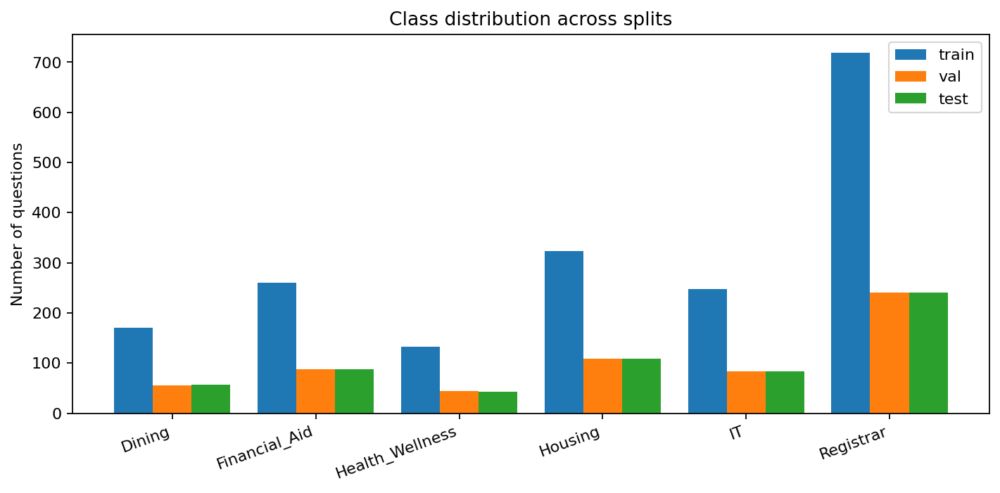
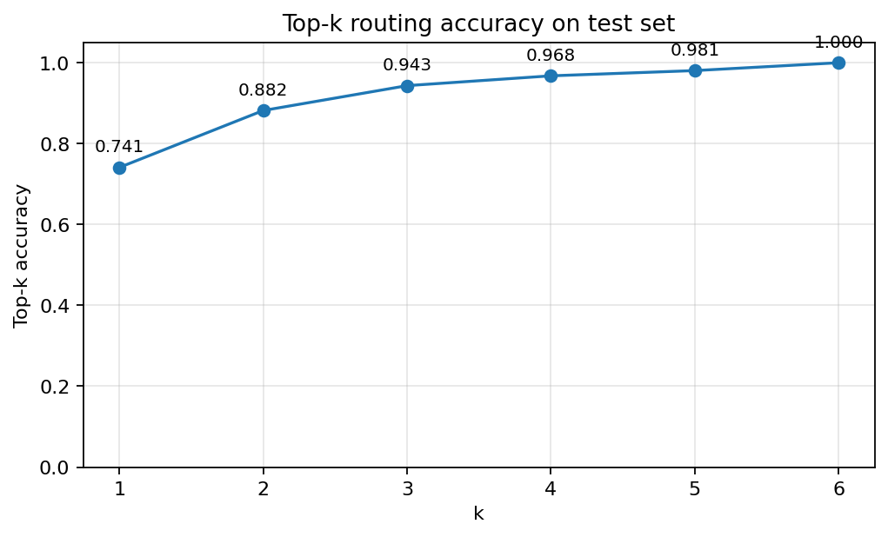
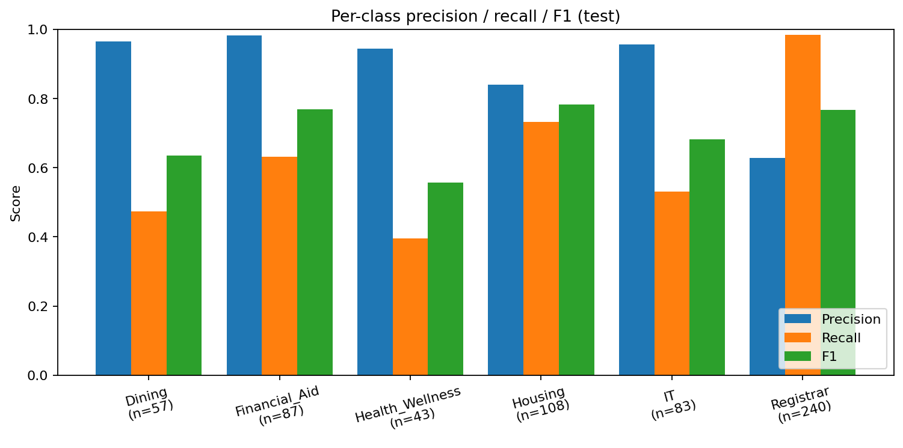
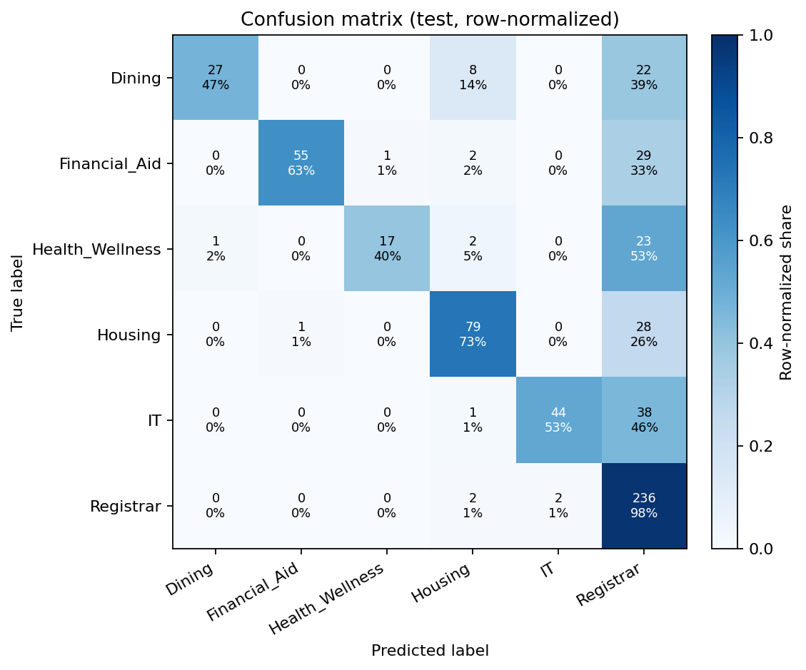
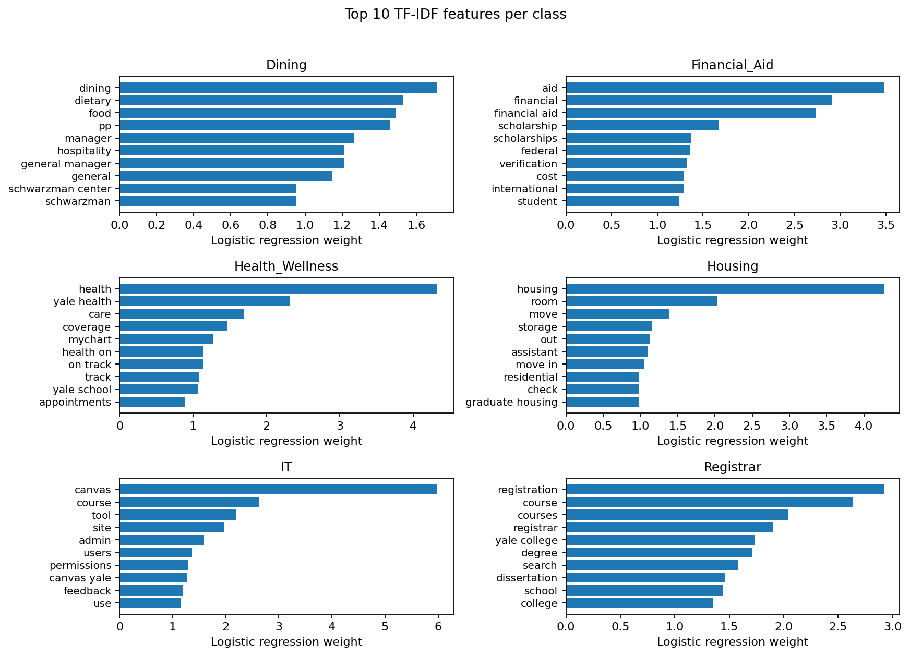
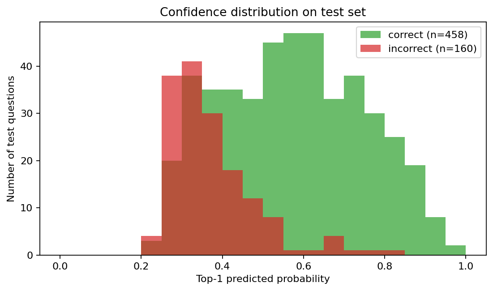
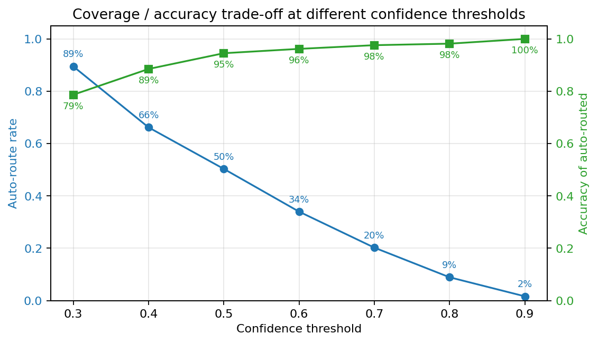

# RouteRight: A Yale Student-Support Intent Classifier

**Course:** CPSC 381/581 Machine Learning — Final Project  
**Team:** Ronald Milgo, Abel Adugna, Kevin Rusagara

---

## 1. Introduction

Yale students send thousands of short questions per term through email forms,
helpdesk channels, and chatbots. Even small misroutings — a financial-aid
question that lands in the registrar's inbox, a dining-services question that
ends up with IT — produce delayed answers and silent rework for staff. Hand
written keyword rules cover the easy cases but break on phrasing variation
("FAFSA appeal" vs "scholarship review"), multi-office wording, and informal
student English.

**Problem.** Given a short student question, predict which of six Yale
support offices should triage it: Registrar, Financial_Aid, Housing, IT,
Dining, or Health_Wellness.

**Approach.** We frame the task as supervised multiclass text classification
over **public Yale FAQ pages**. The primary baseline is a TF-IDF + logistic
regression pipeline, which gives interpretable per-class word weights. We
also train **Multinomial Naive Bayes** (count features) and a **calibrated
Linear SVM** on the same splits, using the same evaluation code.

**Why this matters for the course.** Beyond accuracy, we focus on three
properties relevant to real triage: (1) class-imbalanced behavior, where the
largest office can dominate predictions; (2) **top-3 accuracy** as a routing
usefulness metric, because a human or downstream router only needs the right
office to appear in a small shortlist; and (3) confidence calibration,
because low-confidence predictions can be deferred to a human.

## 2. Data

### 2.1 Sources

The training data is collected from **public Yale support and FAQ pages**.
High-level sources are tracked in `data/raw/faq_sources.csv`; the seeds used
by the polite crawler live in `data/raw/yale_faq_seed_urls.csv`. Each row in
`data/raw/collected_questions.csv` carries provenance columns
(`text, label, source_name, school, url`) so the report and grader can trace
every example back to a Yale page.

| Stage | Rows |
|---|---|
| Raw collected questions | 3,089 |
| After cleaning + dedupe (`src/clean_dataset.py`) | **3,089** |
| Train / Val / Test (60 / 20 / 20, stratified) | 1,853 / 618 / 618 |
| Schools represented | Yale only (no supplemental rows used) |

**Class distribution.** All six offices are represented but with substantial
imbalance — Registrar is roughly **5.5×** the smallest class, Health_Wellness:

| Label | Train | Val | Test | Total |
|---|---|---|---|---|
| Registrar | 719 | 240 | 240 | 1,199 |
| Housing | 323 | 108 | 108 | 539 |
| Financial_Aid | 260 | 87 | 87 | 434 |
| IT | 248 | 83 | 83 | 414 |
| Dining | 170 | 57 | 57 | 284 |
| Health_Wellness | 133 | 43 | 43 | 219 |



### 2.2 Labeling rules

`reports/labeling_rules.md` defines six **mutually exclusive** office labels.
For ambiguous multi-intent text, we assign the office that would *first*
triage the case. Borderline rows were either skipped (and noted for error
analysis) or labeled by the office page that the text was extracted from.

### 2.3 Cleaning and splits

`src/preprocess.clean_text` lowercases, trims, and collapses whitespace; we
intentionally keep punctuation so TF-IDF preserves word boundaries.
`src/clean_dataset.py` further enforces the six allowed labels, removes empty
rows, and deduplicates by cleaned text. `src/split_data.py` produces a
**stratified 60 / 20 / 20** split with `random_state=42` so re-runs are
reproducible.

### 2.4 EDA highlights

A full exploratory analysis lives in
[`notebooks/exploration.ipynb`](../notebooks/exploration.ipynb). Key numbers
that inform the modeling choices:

- **Length.** Median 10 tokens, 95th percentile 48 tokens. Per-class medians
  cluster at 10–11 except Dining (7), so length carries almost no
  class-discriminating signal except to single Dining out.
- **Vocabulary.** ~4.6K unigrams and ~28K unigram+bigram features after
  `min_df=2`. The smallest class still has a healthy type/token ratio — the
  recall problem is a *prior* problem, not a vocabulary-shortage problem.
- **Cross-class overlap.** Pairwise Jaccard overlap of unigram vocabularies
  is ~0.20 between Registrar and most other classes, and 0.21 between
  Financial_Aid ↔ Health_Wellness. These are the same pairs that dominate
  the confusion matrix in §5.3.
- **Source diversity.** Registrar draws on 62 distinct URLs and Housing on
  52, but **Health_Wellness has only 16 distinct URLs** — its training
  signal is narrower than the row count suggests, which compounds the class
  imbalance. Concrete next-iteration item: expand crawl seeds for
  Health_Wellness.

## 3. Methodology

### 3.1 Learning formulation

Supervised multiclass classification: input is a single short question, output
is one of six office labels.

### 3.2 Features

We use `TfidfVectorizer` with:

- `ngram_range=(1, 2)` — unigrams and bigrams, since multiword phrases like
  *"net id"* and *"financial aid"* are highly office-discriminative.
- `min_df=1` — small dataset (≈1,850 train rows); we keep rare terms.
- `sublinear_tf=True` — log-scale term frequency, dampens long policy lines.

### 3.3 Models

- **Baseline:** `LogisticRegression(solver="lbfgs", max_iter=5000)` in a scikit-learn
  `Pipeline` with the TF–IDF vectorizer above. Multiclass training uses the
  **multinomial logistic loss** (equivalently, categorical cross-entropy up to
  an additive constant), optimized with **L-BFGS** (a quasi-Newton method on the
  penalized negative log-likelihood; there is no learning rate or minibatch
  schedule because the optimizer sees the full training set each step).
- **Multinomial Naive Bayes:** `CountVectorizer` (unigrams + bigrams) + `MultinomialNB`.
  Hyperparameters are chosen by **grid search** on the training fold with
  **macro F1** as the score; see `results/metrics_nb.json` for the selected
  `alpha` and `min_df`.
- **Linear SVM (calibrated):** TF–IDF + `LinearSVC` wrapped in
  `CalibratedClassifierCV` so the pipeline exposes `predict_proba` for top‑k
  metrics. Hyperparameters are tuned the same way; see `results/metrics_svm.json`.

### 3.4 Metrics

We report accuracy, **macro F1** (treats every office equally — important
under imbalance), weighted F1 (matches a typical user's experience), per-class
precision/recall/F1, and **top-3 accuracy** (the true office is in the model's
top three predictions). Top-3 is our headline routing-usefulness metric: a
shortlist with the right office is good enough for many triage workflows.

## 4. Implementation Details

| Component | Path | Notes |
|---|---|---|
| Text cleaning | `src/preprocess.py:clean_text` | lowercase, strip, whitespace |
| Dataset cleaning | `src/clean_dataset.py` | label whitelist + dedupe |
| Data crawling | `src/collect_yale_faqs.py` | polite, robots.txt, slow delay |
| Splits | `src/split_data.py` | stratified 60/20/20, seed=42 |
| Baseline training | `src/train_baseline.py` | TF-IDF (1, 2), `min_df=1`, `sublinear_tf=True` + logistic regression (`max_iter=5000`) |
| Comparison models | `src/train_models.py` | NB / Linear SVM (Abel) |
| Evaluation | `src/evaluate.py` | accuracy, macro/weighted F1, per-class, top-3 |
| Demo | `src/demo.py` | top-k CLI with confidence bars, `--stdin`, `--interactive`, `--model` |
| Figures | `src/figures.py` | every figure in this report |
| Trained model | `results/logistic_regression_tfidf.joblib` | gitignored, regenerate |
| Metrics dump | `results/metrics_baseline.json` | gitignored, regenerate |

**Reproducibility.** From a fresh clone:

```bash
python -m venv .venv && source .venv/bin/activate
pip install -r requirements.txt
python -m src.clean_dataset
python -m src.split_data --input data/processed/final_dataset.csv
python -m src.train_baseline
python -m src.figures
```

## 5. Results

### 5.1 Headline numbers (TF-IDF + Logistic Regression)

| Split | Accuracy | Macro F1 | Weighted F1 | Top-3 accuracy |
|---|---:|---:|---:|---:|
| Train | 0.927 | 0.914 | 0.925 | 0.999 |
| Validation | 0.769 | 0.722 | 0.760 | 0.953 |
| **Test** | **0.741** | **0.699** | **0.732** | **0.943** |

The 19-point train / test accuracy gap and the F1-macro vs weighted gap point
at two real phenomena: (a) overfitting on a high-dimensional sparse TF-IDF
space with only ~1.8K training rows, and (b) class imbalance that pushes
weighted scores up relative to macro scores.

**Top-k routing accuracy** (test):



The shape of this curve is the most actionable result for deployment: even
when the top-1 prediction is wrong, the right office is in the top-3 in
**94.3%** of cases and the top-5 in **98.1%**. A real triage agent would
benefit far more from a shortlist than from a single hard label.

### 5.2 Per-class breakdown



| Class | Precision | Recall | F1 | Support |
|---|---:|---:|---:|---:|
| Registrar | 0.63 | **0.98** | 0.77 | 240 |
| Housing | 0.84 | 0.73 | 0.78 | 108 |
| Financial_Aid | 0.98 | 0.63 | 0.77 | 87 |
| IT | 0.96 | 0.53 | 0.68 | 83 |
| Dining | 0.97 | 0.47 | 0.64 | 57 |
| Health_Wellness | 0.94 | 0.40 | 0.56 | 43 |

Every non-Registrar class is **precision-heavy and recall-light**: when the
model says "IT", it is almost always right (0.96), but it only catches 53% of
true IT questions. Registrar is the inverse: it captures 98% of registrar
questions but only 63% of its predictions are correct. This is a textbook
majority-class bias amplified by Registrar being a semantically broad class
("course", "registration", "school" overlap with most other offices' FAQ
text).

### 5.3 Confusion matrix



Reading the right column, between **26% and 53%** of every other class's true
test examples are misrouted to Registrar. Health_Wellness loses 53% of its
recall this way (23 of 43 true Health_Wellness questions get tagged
Registrar). The other significant confusion is Dining → Housing (14%), which
is plausible because residential dining and housing FAQs share vocabulary
about meal plans tied to room type.

### 5.4 What the model has actually learned



The top-weighted features are sensible, which gives confidence the model is
not memorizing artifacts:

- **Dining:** *dining, dietary, food, hospitality, schwarzman center*.
- **Financial_Aid:** *aid, financial, financial aid, scholarship, federal, verification*.
- **Health_Wellness:** *health, yale health, care, coverage, mychart*.
- **Housing:** *housing, room, move, storage, residential, graduate housing*.
- **IT:** *canvas, course, tool, site, admin, permissions, canvas yale*. Note
  that *course* appearing strongly under IT is a known overlap with Registrar
  and contributes directly to the IT → Registrar confusion seen above.
- **Registrar:** *registration, course, courses, registrar, yale college, degree*.

### 5.5 Confidence is a useful gatekeeper



Incorrect predictions cluster sharply at low top-1 probabilities (peak around
0.30), while correct predictions extend across the full range up to ≈0.95.
Practically: a confidence threshold around 0.50 would let the system auto-route
high-confidence predictions and defer the rest to a human or to a top-3
shortlist UI — exactly the behavior the demo CLI exposes.

#### 5.5.1 Coverage / accuracy trade-off (deployment view)



Sweeping the threshold turns the histogram above into a deployment knob. The
operating points are:

| Confidence threshold | Auto-route rate | Accuracy of auto-routed | Deferred to human |
|---:|---:|---:|---:|
| 0.30 | 89.5% | 78.7% | 65 |
| 0.40 | 66.2% | 88.5% | 209 |
| **0.50** | **50.3%** | **94.5%** | **307** |
| 0.60 | 34.0% | 96.2% | 408 |
| 0.70 | 20.2% | 97.6% | 493 |
| 0.80 | 8.9% | 98.2% | 563 |

A practical operating point is therefore **threshold = 0.50**: half of incoming
questions auto-route at near-95% accuracy, and the remaining half can be
served the top-3 shortlist for a human (or the student themselves) to pick
from. That single curve replaces the abstract "use logistic-regression
confidence" recommendation with a concrete service-level number a triage team
could plan around.

### 5.6 Comparison with Naive Bayes and Linear SVM

We trained the two comparison models in `src/train_models.py` on the **same**
`data/processed/{train,val,test}.csv` files as the baseline. Metrics below are
read from `results/metrics_nb.json` and `results/metrics_svm.json` after a full
re-run of `python -m src.train_models --model all`.

| Model | Test accuracy | Test macro F1 | Test top-3 accuracy |
|---|---:|---:|---:|
| TF–IDF + Logistic Regression (baseline) | 0.741 | 0.699 | 0.943 |
| Counts + Multinomial NB | **0.864** | **0.842** | **0.960** |
| TF–IDF + Calibrated Linear SVM | **0.861** | **0.838** | **0.960** |

**Takeaway.** On this corpus, both alternative linear models clearly beat the
logistic baseline on top‑1 and macro F1 while slightly improving top‑3 routing.
The Naive Bayes pipeline is the simplest and marginally edges the SVM on these
aggregates; either could be preferred depending on deployment constraints
(inference cost, need for calibrated probabilities, maintenance of two
vectorizers). For per-class behavior and confusion structure, re-run
`python -m src.figures --model results/multinomial_nb.joblib` (or the SVM
joblib) into a separate output directory for side-by-side plots.

## 6. Error Analysis

We complement the aggregate numbers with concrete failure modes drawn from
the demo CLI and the test confusion matrix.

1. **Short IT-style questions vs. the Registrar prior.** Even when a question
   mentions accounts or access, overlap with generic academic vocabulary
   (*course*, *registration*, *school*) can push the baseline toward
   **Registrar**. Improving IT-specific coverage in the training text (for
   example more distinct NetID and account-recovery phrasing) usually reduces
   this failure mode.

2. **"FAFSA appeal" routes to Registrar instead of Financial_Aid.** *FAFSA*
   itself is a high-IDF term, but in this query both *appeal* and *FAFSA* sit
   under a Registrar prior because much of the training Financial_Aid corpus
   uses formal phrases like "financial aid verification" rather than "FAFSA"
   alone. This is a wording-mismatch problem: the model has learned the
   *form* of FAQ language better than the *form* of student questions.

3. **Health_Wellness → Registrar (53% of true Health_Wellness).** The biggest
   single failure mode. Inspection of those rows shows that many Yale Health
   FAQ pages contain academic-calendar context ("appointments before the
   start of the term", "leave of absence") that overlaps with Registrar
   vocabulary. A future iteration should either (a) up-weight Health_Wellness
   under-represented classes via `class_weight="balanced"`, or (b) bring more
   Yale Health and counseling FAQ rows into the corpus.

4. **Dining → Housing (14% of true Dining).** Plausible domain overlap (meal
   plans tied to residence halls). This is less concerning because the
   confusion is between two operationally adjacent offices.

5. **The "Registrar trap"**. Aggregating across the whole confusion matrix,
   **148 of 618** test predictions land on Registrar incorrectly (24% of all
   test rows). Every recommendation above either rebalances the loss or
   broadens non-Registrar coverage in the corpus.

### 6.1 Representative misclassified test examples

The table below samples actual test-set errors (two per true class, drawn
deterministically by `src.figures.dump_misclassified_examples`). Two patterns
jump out: the model often *knows* it is uncertain (top-1 confidences cluster
between 0.25 and 0.50, well inside the "defer" band of §5.5.1), and the
correct label is frequently in the top-3 even when the top-1 is wrong.

| True label | Predicted | Top-1 conf. | Top-3 | Question |
|---|---|---:|---|---|
| Dining | Registrar | 0.31 | Registrar, Dining, Housing | cocktail receptions |
| Dining | Registrar | 0.47 | Registrar, Housing, Financial_Aid | what about greek cuisine in the u.s. and is it constantly rising? |
| Financial_Aid | Registrar | 0.30 | Registrar, Financial_Aid, Housing | the last day to submit a request for review for matriculated and continuing students is march 15th of the s… |
| Financial_Aid | Registrar | 0.44 | Registrar, Financial_Aid, Housing | fafsa (yale college's code: 001426) |
| Health_Wellness | Housing | 0.25 | Housing, Registrar, Dining | bridgeport hospital – milford campus, 300 seaside avenue, milford |
| Health_Wellness | Registrar | 0.33 | Registrar, Housing, Financial_Aid | designation of patient spokesperson |
| Housing | Registrar | 0.38 | Registrar, Housing, Financial_Aid | seeking medical help/assistance if someone shows signs of alcohol poisoning. |
| Housing | Registrar | 0.28 | Registrar, Housing, Financial_Aid | current full-time opportunities |
| IT | Registrar | 0.31 | Registrar, Housing, Financial_Aid | quick start guide for instructors |
| IT | Registrar | 0.37 | Registrar, IT, Housing | certificate or non-academic program support staff |
| Registrar | IT | 0.26 | IT, Registrar, Housing | comprehensive feedback |
| Registrar | IT | 0.51 | IT, Registrar, Housing | how long will i have access to canvas course sites if i place a course on my canvas worksheet? |

Every error in the first 10 rows is a *recovered* error: the true office is
already in the top-3, so a shortlist UI would have surfaced it. The last
two rows are the harder case — true-Registrar examples that lost their own
top-1 to IT — and they reveal that some Registrar-labeled FAQ rows are
themselves crawl noise ("comprehensive feedback") or genuinely span two
offices ("canvas course sites"). Cleaning these would help precision more
than any modeling change.

## 7. Limitations and Ethical Use

- **Yale-only corpus.** The model is trained on public Yale FAQ pages. It is
  not designed to generalize to other universities; supplemental rows were
  not used. Deploying to a different institution requires retraining.
- **No personally identifiable information.** Training data is paraphrased
  from public FAQs; we did not ingest tickets, student identifiers, or
  email content.
- **Out-of-scope deployment.** Live routing into Yale's ticketing system is
  out of scope for the course. The intended artifact is a prototype CLI demo
  and an evaluation report, not a production endpoint.
- **Calibration.** Logistic regression probabilities are usable but not
  formally calibrated. A production routing system would want either Platt
  scaling on a held-out set or a calibrated alternative.
- **Class imbalance.** The Registrar class is ~5.5× the size of
  Health_Wellness; aggregate accuracy partially hides this. We report macro
  F1 and per-class metrics so the reader can see the imbalance directly.

## 8. Conclusion

A TF–IDF + logistic regression baseline reaches **0.741 test accuracy** and
**0.943 top-3 accuracy** on six-way Yale support routing; the dominant failure
mode is over-prediction of **Registrar**, visible in per-class metrics, the
confusion matrix, and the top weighted features. In practice a **top‑3
shortlist** plus a **confidence gate** is a better framing than forcing a
single label; §5.5 and the CLI demo illustrate that workflow.

Adding **Multinomial Naive Bayes** and a **calibrated Linear SVM** on the same
splits materially improves held-out accuracy and macro F1 (**~0.86 / ~0.84**
for both), with top‑3 accuracy **0.960** (§5.6). The remaining errors are still
concentrated on offices with overlapping FAQ vocabulary—especially Health and
financial wording against Registrar—which points to **data augmentation and
cleanup** as the next lever, not only a different classifier.

---

### Appendix A — Reproducing the figures and report numbers

```bash
source .venv/bin/activate
python -m src.clean_dataset
python -m src.split_data --input data/processed/final_dataset.csv
python -m src.train_baseline
python -m src.figures
# Then read results/metrics_baseline.json and reports/figures/*.png
```

To rebuild `reports/final_report.pdf` from the markdown source (requires
`pandoc` and either Google Chrome or another Chromium-based browser):

```bash
cd reports
pandoc final_report.md --standalone --css=.report_style.css \
  --embed-resources --metadata title="RouteRight — Final Report" \
  -o .final_report.html
"/Applications/Google Chrome.app/Contents/MacOS/Google Chrome" \
  --headless=new --disable-gpu --no-pdf-header-footer \
  --print-to-pdf=final_report.pdf "file://$(pwd)/.final_report.html"
```

### Appendix B — Demo CLI

```bash
python -m src.demo "How do I reset my NetID password?"
python -m src.demo --top-k 5 "Where do I file a FAFSA appeal?"
python -m src.demo --interactive
echo "What dining halls are open on Sunday?" | python -m src.demo --stdin
python -m src.demo --model results/multinomial_nb.joblib "..."
```
